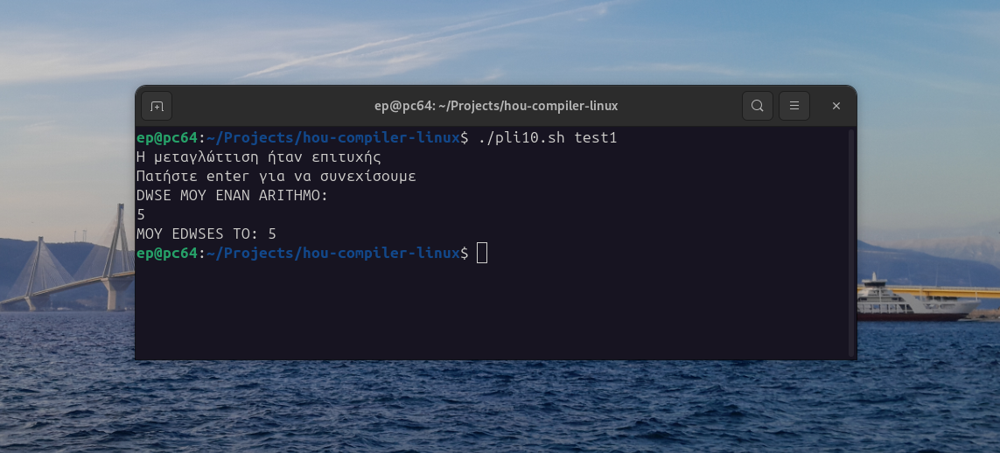

# hou-compiler-linux



## Purpose

Run Hellenic Open University's Software Engineering PLH10 compiler -finally- under Linux !

## Disclaimer

Please make sure to back up your scripts regularly and have access to a Windows machine in case this program doesn't work for you.

I take no responsibility for its use in your university or in any other way.

## Dependencies

This program requires the 32-bit version of Wine. If you check the script (pli10.sh), it actually attempts to install it by itself:

```
sudo dpkg --add-architecture i386
sudo apt update
sudo apt install wine32
```

## How to Use

### 1. Create the program

Create a file -at the root of the project- named `<NAME>.utf8.eap` -  where `<NAME>` is the name you want your program to have.

For example : 
```
bubbleshort.utf8.eap
```

In this file, write your code and save it. 

The content must be in UTF-8 encoding (which is usually the default).

### 2. Encode, compile, run

Now, simply run `./pli10.sh <NAME>`. Without the `.utf8.eap` part.

For example :
```
./pli10.sh bubbleshort
```

**This will encode\*, compile and run the program.**

\* By encoding, we mean converting from UTF-8 to CP1253, which is required by the legacy compiler.

### 3. Examples

You can find the following examples :
- `test1.utf8.eap` 
- `test2.utf8.eap`

To run them : 

```
/pli10.sh test1
```
```
/pli10.sh test2
```

## Weak Points

**Don't use Greek characters in either the output or the input of the program. Use Greeklish instead !**

### Example :

#### Code :

```
ΑΛΓΟΡΙΘΜΟΣ ΔΟΚΙΜΗ
	ΔΕΔΟΜΕΝΑ x:INTEGER;
ΑΡΧΗ
	ΤΥΠΩΣΕ ("DWSE MOY ENAN ARITHMO: ", EOLN);
	ΔΙΑΒΑΣΕ (x);
	ΤΥΠΩΣΕ ("MOY EDWSES TO: ", x, EOLN)
ΤΕΛΟΣ
```

#### Execution :

```
DWSE MOY ENAN ARITHMO: 5
```

Here, it is clear that 5 is a number. 

However, if it were text, use Greeklish, such as "Paradeigma" instead of "Παράδειγμα."

## Developer Notes

There is a reason all files are thrown on the same place and it's because the compiler strugles to work with files out of it's directory.
